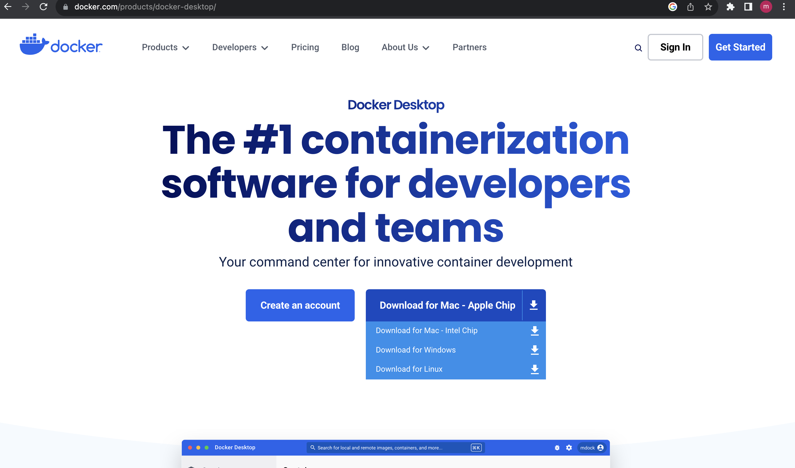
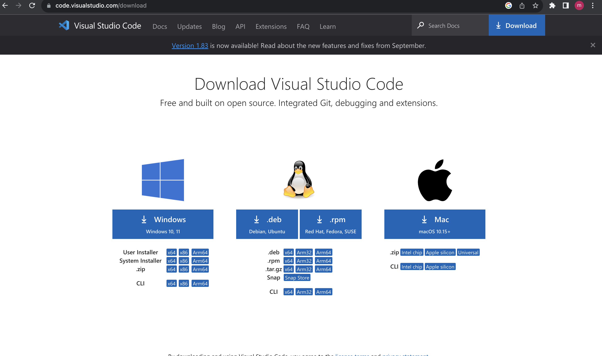
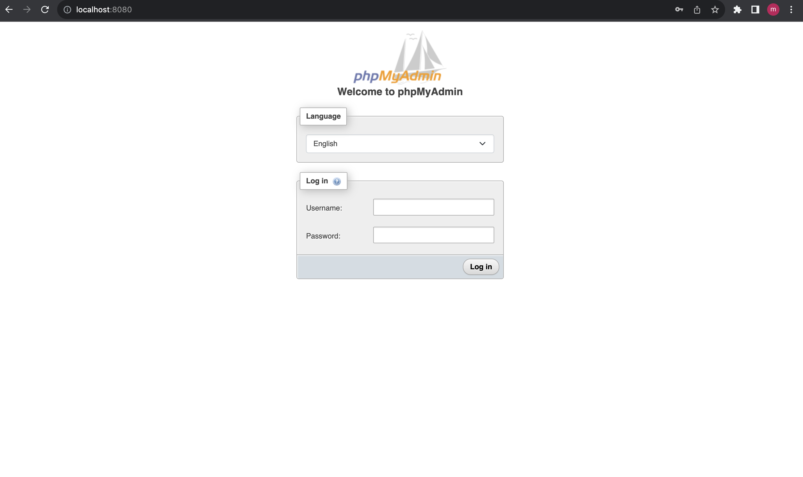

# Getting Started with PHP and MariaDB: A Beginner's Guide to Database Interaction

## Introduction 

In today's digital age, understanding how to work with databases is essential for web developers and programmers. This tutorial blog, "Getting Started with PHP and MariaDB," is designed to provide a comprehensive introduction to the world of database management, focusing on the popular PHP scripting language and MariaDB, a widely-used open-source relational database management system.

In this tutorial, we will walk you through the essential steps to access MariaDB from a PHP application and explore the fundamental concepts of SQL (Structured Query Language) commands. We'll define key terms, such as databases, tables, queries, and more, ensuring that even those new to the world of databases can follow along with ease. By the end of this guide, you'll have a strong foundation for building dynamic, data-driven web applications and a solid grasp of how to interact with MariaDB using PHP.

Whether you're a novice looking to begin your journey in web development or an experienced developer seeking to expand your database skills, this tutorial will empower you with the knowledge and tools needed to harness the power of PHP and MariaDB for your projects.

# Download and Install Docker
Downloading Docker Desktop is the first crucial step in setting up your development environment. Docker Desktop is a powerful tool that allows you to create, manage, and run containerized applications effortlessly. To get started, follow these instructions to download Docker Desktop for your respective operating system.

For Windows Users:

Begin by visiting the official Docker website at https://www.docker.com/products/docker-desktop.
On the Docker Desktop page, you'll find the download button specifically tailored for Windows. Click on it.
Once the download is complete, run the installer. You may need to grant administrative privileges during the installation process.
Follow the on-screen instructions to set up Docker Desktop on your Windows machine. Docker may require enabling features like Hyper-V and Windows Subsystem for Linux (WSL) during this process.
After installation, Docker Desktop will be up and running, and you'll see the Docker icon in your system tray. You are now ready to start working with containers on your Windows system.
For macOS Users:

Visit the official Docker website at https://www.docker.com/products/docker-desktop to access the Docker Desktop page.

Locate and click the download button specifically designed for macOS.
Once the download is complete, open the Docker.dmg file.
Drag and drop the Docker icon into the Applications folder to complete the installation.
Navigate to your Applications folder, find Docker, and double-click to launch it.
Docker Desktop will start, and you'll see the Docker whale icon in your menu bar. Your macOS machine is now ready to create and manage containers.
These steps will ensure you have Docker Desktop installed and ready to begin your containerization journey on either Windows or macOS. Docker Desktop streamlines the containerization process, making it accessible and efficient for developers across different operating systems.

Once you have downloaded docker, you can just have it running in the background, but just be aware that it can take a lot of your processing memory while it is running so it might slow some downloads or other systems down while it is running. So just don't have it running for fun. 

# Open a Code editor
In order to effectively follow along with this tutorial and make the most out of our walkthrough, it's essential to have a code development environment ready. For this purpose, we'll be using Visual Studio Code, a popular and versatile source code editor that offers a wealth of features for web development and programming tasks. If you haven't already installed Visual Studio Code, here's how to get started:

Step 1: Download Visual Studio Code

Begin by visiting the official Visual Studio Code website at https://code.visualstudio.com/.
On the website's main page, you'll find a prominent "Download for Windows" button for Windows users, a "Download for macOS" button for macOS users, and a "Download for Linux" button for Linux users. Click the appropriate button for your operating system.

Step 2: Install and Launch
Follow the installation steps for each operating system respectively and configure how you will. It should be a straight forward proccess, but if you have any troubles I would refer to the download page for any troubleshooting. 

# Open a new project

Click on New File and make a .yml for Windows Machines and a .arm For Mac or IOS Machines. file titled the following 

docker-compose.yml 

or 

docker-compose.arm

In this tutorial we will not be covering docker or .yml and the science behind it, but we will need to use it, so copy this code and paste it into your new .yml file you just created. This will allow us to use the localhost on your web browser and access mariabd through a website called PHPmyAdmin. 

    version: "3.7"
    services:
      web:
      container_name: lab-3-apache-php
      build: .
    ports:
      - 80:80
      - 443:443
    volumes:
      - ./src:/var/www/html
    depends_on:
      - mariadb
    env_file: 
      - .env

    mariadb:
    container_name: lab-3-mariadb
    image: mariadb
    volumes:
      - mariadb:/var/lib/mysql
    ports:
      - 3306:3306
    restart: always
    environment:
      MYSQL_ALLOW_EMPTY_PASSWORD: "no"
      MYSQL_ROOT_PASSWORD: toor

      MYSQL_USER: $MYSQL_USER
      MYSQL_PASSWORD: $MYSQL_PASSWORD
      MYSQL_DATABASE: $MYSQL_DATABASE

    phpmyadmin:
    container_name: lab-3-phpmyadmin
    image: arm64v8/phpmyadmin
    depends_on:
      - mariadb
    restart: always
    ports:
      - 8080:80
    environment:
      PMA_HOST: mariadb
      MYSQL_ROOT_PASSWORD: toor

    volumes:
     mariadb:

# PHP Code 
 Now you are ready to create a php page to access the database. Here is the code for this basic page that will be linked with the database we use.

 https://github.com/BYU-ITC-210/lab-3b-MariaF7117/tree/master/src 

You will need to add each of the files from the following folders

- actions
- css
- views

You will also need to create an index.php. This will be your main page. 

With all of these created in the appropriate folders and file directory, we can get to the database section of this tutorial. 

# phpMyAdmin create Database
With Docker up you can type in the visual studio code
terminal the command

    docker compose up -d
This will start the containers.
Without this step, docker will not start running and it will not open your localhost. Because in the docker.yml file we made the phpMyAdmin page assigned to port 8080, that is what we will type in when we want to access the database.

In your web browser type in

    localhost:8080

8080 is the port that the database is located on. 

It will bring you to a page that looks like this.

Enter the Username and Password from the website.

Once you are in you will be able to start creating your database. 

Go to the top left corner and click Databases

Click on create database 

Name it lab_3 and then under the top left Stucture tab select Create New Table.

# Create Table
- Create a new table called `'user'` in the `'lab_3'` database
- Add the following fields:

click `'go'` and create the table.

# Test it Out!

Now after all your hard work you can test it out! Go to `'localhost'` and it will direct you to a login page. Since the database has no users, you will navigate to the register user page using the button under login. Register a new user, it will direct you back to the login page after you have done that and then enter the new user's credentials and login! 

# Check Database

You can see the new user in the database under the table you just created. You will see your user and a hashed password, but it is your password that you entered, so don't forget it.

# Conclusion

In conclusion, this tutorial has equipped you with the fundamental knowledge and practical skills needed to embark on your journey with PHP and MariaDB. We began by ensuring you had the essential tools, including Docker Desktop for easy containerization and Visual Studio Code for a streamlined coding environment.

With Docker set up and your project created, we delved into the world of database interaction. You learned how to create a MariaDB database using phpMyAdmin and established a connection to it. The tutorial walked you through the process of creating a user table and even allowed you to test your database by registering a new user.

By following this tutorial, you've gained a strong foundation in working with PHP and MariaDB. These skills will be invaluable as you continue your web development journey, allowing you to build dynamic, data-driven web applications with confidence. Keep exploring and experimenting with databases, as there's no better way to solidify your understanding and take your development skills to the next level. Happy coding!

## References

- [MariaDB walkthrough](https://mariadb.com/resources/blog/developer-quickstart-php-mysqli-and-mariadb/) 
- [phpMyAdmin](https://www.phpmyadmin.net/)  
- [MariaDB](https://mariadb.org/documentation/)
- [Docker Walkthrough](https://docs.docker.com/desktop/)